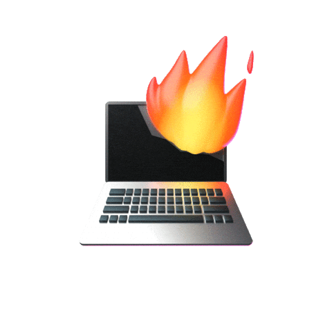

  

<h2 align="center">
  Hey there,  I’m Tim
  
</h2>

  I'm a <strong>CompSci Student</strong>, <strong>Software Engineer</strong> and <strong>Linux Enthusiast</strong> from Germany. 
  I love learning about and using new technologies, from programming languages to frameworks and tools. 
  I especially enjoy working with <strong>Linux</strong> and everything <strong>Server</strong>, <strong>Homelab</strong> and <strong>Networking</strong> related.

  

<h2 align="center">
  Technologies I use
  
</h2>

                                                

 

<h2 align="center">
  GitHub Profile Stats
  
</h2>

 
 

 

<h2 align="center">
  Best Music to vibe to
  
</h2>

  <a href="https://open.spotify.com/playlist/4fpUWp3D1N953IgjWihZcJ" target="_blank">
    
  
(Click the image)

  </a>
 

<h2 align="center">
  Quotes by the smartest programmer that's ever lived
  
</h2>

